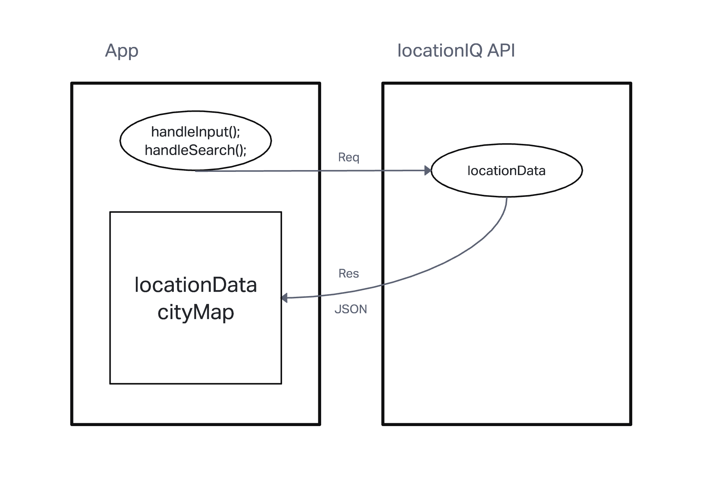
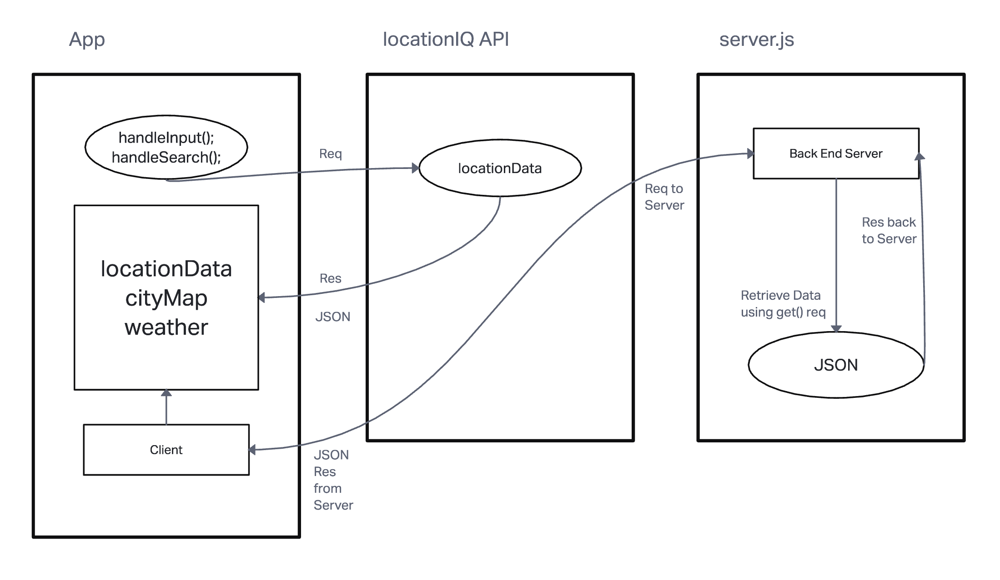
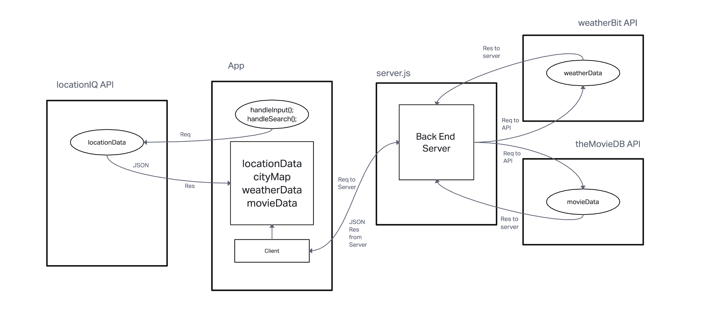

# City Explorer App

**Author**: Dustin Apodaca
**Version**: 1.0.4

## Overview
<!-- Provide a high level overview of what this application is and why you are building it, beyond the fact that it's an assignment for this class. (i.e. What's your problem domain?) -->

## Getting Started
<!-- What are the steps that a user must take in order to build this app on their own machine and get it running? -->

## Architecture

<!-- Provide a detailed description of the application design. What technologies (languages, libraries, etc) you're using, and any other relevant design information. -->

## Change Log

**09-26-2022** 6:55p.m. - Applicaton has a fully functional front-end that utilizes locationIQ API to render City Information including the area map.

**09-27-2022** 6:35p.m. - Application now has a fully-functional express server, with a GET route for the location resource.

**09-28-2022** 6:35p.m. - TBD

**09-29-2022** 6:35p.m. - TBD

## Credit and Collaborations

* Erik M. Dodd
* Diego Sousa
* Julian Gallegos
* Maximo VincenteMejia

<!-- Give credit (and a link) to other people or resources that helped you build this application. -->

This project was bootstrapped with [Create React App](https://github.com/facebook/create-react-app).
